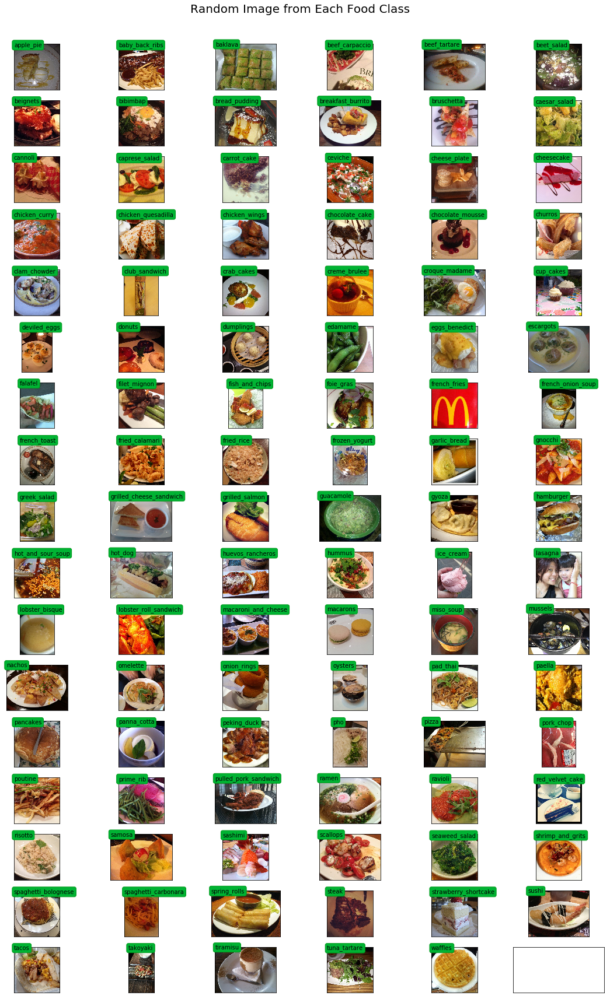
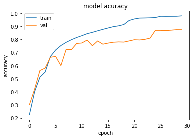
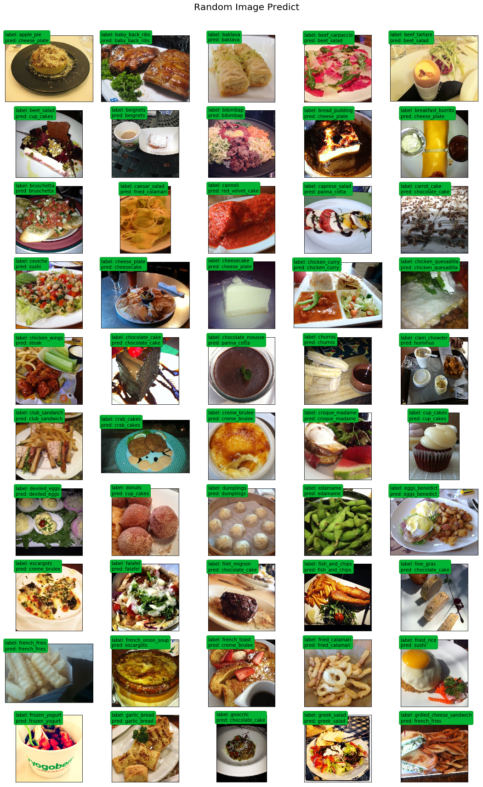

# 101-Food Classification using Transfer Learning Icep
[](https://github.com/DucLeTrong/food101-classification)

## About data set

Food 101 is a labelled data set with 101 different food classes. Each food class contains 1000 images. Using the data provided,  a deep learning model built on Keras/TensorFlow is trained to classify 101 classes in Food 101 dataset.


[Data available here](https://drive.google.com/drive/folders/1THy6bN6pwHEmRvLxfiGcW8dez5VwxzvG?usp=sharing)

## Prepare data set
- Download data set
```
>> wget http://data.vision.ee.ethz.ch/cvl/food-101.tar.gz
>> tar -xvf /content/drive/My\ Drive/project2/food-101.tar.gz > /dev/null 2>&1
```
- Split training and test data set

Images are split to train and test set with 750 and 250 images per class respectively. 
```
>> python3 split_train_test_folder.py 
```
## Training 
```
>> python3 train.py
```
## Visulize the result

### Training data
```python
root_dir = 'food-101/images/'
rows = 17
cols = 6
fig, ax = plt.subplots(rows, cols, frameon=False, figsize=(15, 25))
fig.suptitle('Random Image from Each Food Class', fontsize=20)
sorted_food_dirs = sorted(os.listdir(root_dir))
for i in range(rows):
    for j in range(cols):
        try:
            food_dir = sorted_food_dirs[i*cols + j]
        except:
            break
        all_files = os.listdir(os.path.join(root_dir, food_dir))
        rand_img = np.random.choice(all_files)
        img = plt.imread(os.path.join(root_dir, food_dir, rand_img))
        ax[i][j].imshow(img)
        ec = (0, .6, .1)
        fc = (0, .7, .2)
        ax[i][j].text(0, -20, food_dir, size=10, rotation=0,
                ha="left", va="top", 
                bbox=dict(boxstyle="round", ec=ec, fc=fc))
plt.setp(ax, xticks=[], yticks=[])
plt.tight_layout(rect=[0, 0.03, 1, 0.95])
```




### Model accuracy 




### Some prediction with test data set
```python
root_dir = 'food-101/images/'
rows = 10
cols = 5
fig, ax = plt.subplots(rows, cols, frameon=False, figsize=(15, 25))
fig.suptitle('Random Image Predict', fontsize=20)
sorted_food_dirs = sorted(os.listdir(root_dir))

for i in range(rows):
    for j in range(cols):
        try:
            food_dir = sorted_food_dirs[i*cols + j]
        except:
            break
        all_files = os.listdir(os.path.join(root_dir, food_dir))
        rand_img = np.random.choice(all_files)
        img = plt.imread(os.path.join(root_dir, food_dir, rand_img))
        while (np.array(img).shape[1] < 299 or np.array(img).shape[0] < 299):
            rand_img = np.random.choice(all_files)
            img = plt.imread(os.path.join(root_dir, food_dir, rand_img))
#             print('a')
        preds = predict_10_crop(np.array(img), 0)[0]
    # print(preds)
        best_pred = collections.Counter(preds).most_common(1)[0][0]
        pred = ix_to_class[best_pred]
        ax[i][j].imshow(img)
        ec = (0, .6, .1)
        fc = (0, .7, .2)
        ax[i][j].text(0, -20, "label: "+food_dir+ '\n'+'pred: ' + pred , size=10, rotation=0,
                ha="left", va="top", 
                bbox=dict(boxstyle="round", ec=ec, fc=fc))
plt.setp(ax, xticks=[], yticks=[])
plt.tight_layout(rect=[0, 0.03, 1, 0.95])
```




